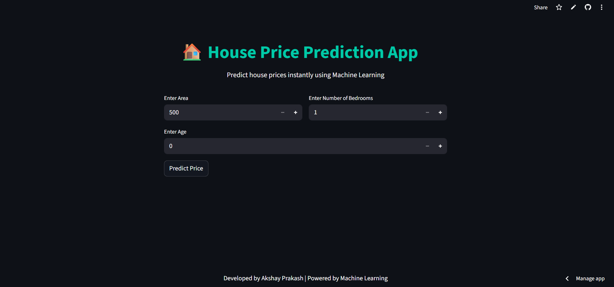

# House Price Prediction using Linear Regression (Machine Learning)

## 📌 Project Overview

This project predicts house prices based on features such as area, number of bedrooms, and age of the house using a Linear Regression model.

It also includes an interactive web application built with Streamlit, allowing users to input house details and get real-time price predictions.

The project demonstrates a complete machine learning workflow, including data preprocessing, feature scaling, model training, and deployment through a user-friendly interface.

---

## 🚀 Features

- Multi-feature house price prediction using Linear Regression
- Data preprocessing and feature scaling using StandardScaler
- Interactive web application built with Streamlit
  Real-time predictions with user-friendly input interface
- Model persistence using joblib (model + scaler)
- Supports both CLI and web-based prediction
- Modular and clean project structure

---

## 🧠 Concepts Used

- Supervised Learning
- Linear Regression (Multiple Variables)
- Feature Scaling
- Model Training & Prediction
- Data Preprocessing

---

## 📂 Project Structure

```
house-price-prediction/
│
├── data/
│   └── house.csv
│
├── frontend_ui/
│   └── app.py      # Streamlit web app for UI-based prediction
│
├── model/
│   ├── house_pricing_pred_model.pkl
│   └── scaler.pkl
│
├── src/
│   ├── main.py        # Training and saving model
│   └── predict_price.py     # User input prediction
│
├── requirements.txt
└── README.md
```

---

## 📊 Dataset

The dataset contains:

- **Area** → Size of the house
- **Bedrooms** → Number of bedrooms
- **Age** → Age of the house
- **Price** → Target value

Example:

```
Area,Bedrooms,Age,Price
1000,2,10,30000
1500,3,5,50000
2000,4,3,65000
```

---

## ▶️ How to Run the Project

### 1️⃣ Clone the repository

```bash
git clone https://github.com/finiaks/house-price-prediction-ml.git
```

---

### 2️⃣ Install dependencies

```bash
pip install -r requirements.txt
```

---

### 3️⃣ Train the model

```bash
python src/main.py
```

---

### 4️⃣ Run prediction

```bash
python src/predict.py
```

---

### 5️⃣ Enter input

```
Enter Area: 2000
Enter Bedrooms: 4
Enter Age: 3
```

---

### ✅ Output

```
Predicted Price: 64153
```

---

## 🌐 Run Web App

```bash
streamlit run frontend_ui/app.py

```

---

## 🌐 Live Demo

https://house-pricingpredictor.streamlit.app/

---

## 📸 Screenshot of App



---

## ⚠️ Important Notes

- Input data is scaled before prediction
- Model performance depends on dataset quality
- Works best within dataset range

---

## 🛠️ Tech Stack

- Python
- Pandas
- Scikit-learn
- Joblib
- Streamlit

---

## 📈 Future Improvements

- Add more features (location, floor, amenities)
- Use larger real-world dataset

---

## 💡 Conclusion

This project shows how machine learning can be used to predict house prices using multiple features and proper data preprocessing techniques.

---

## 👨‍💻 Author

Akshay Prakash

```

```
